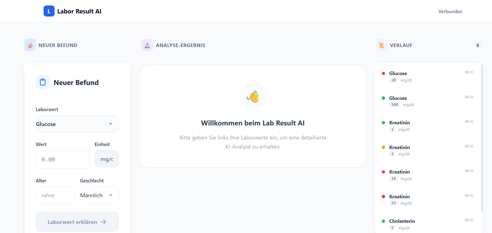
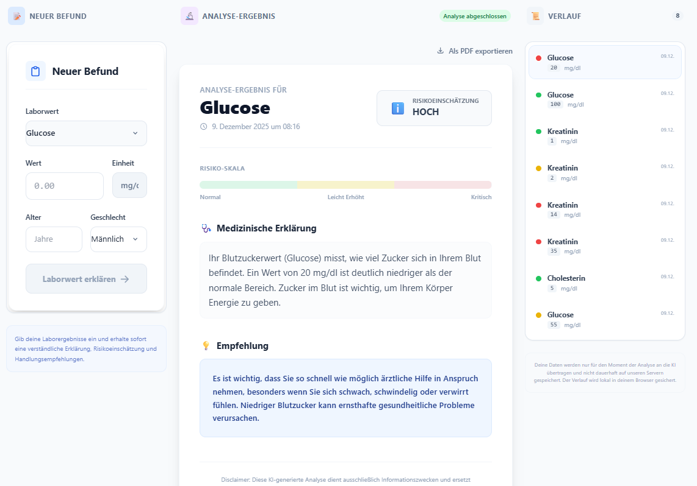
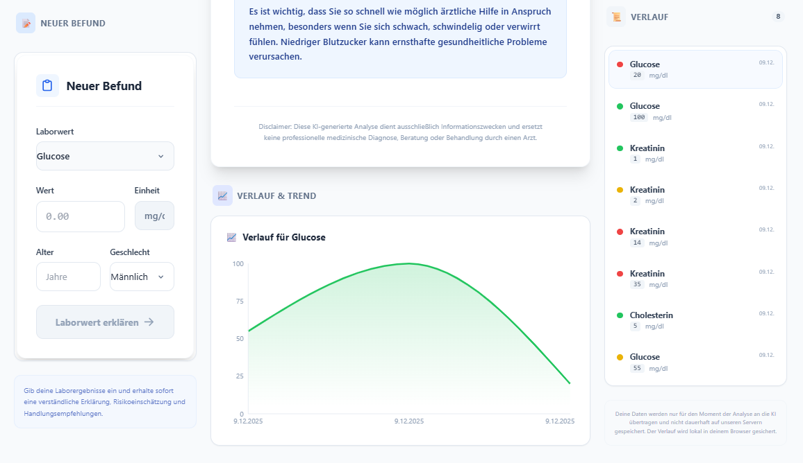
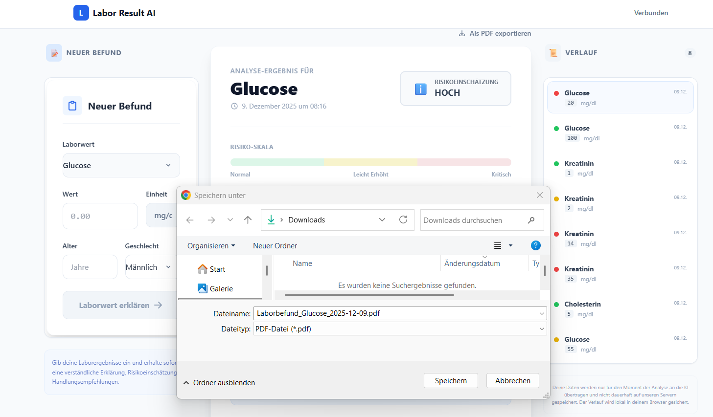
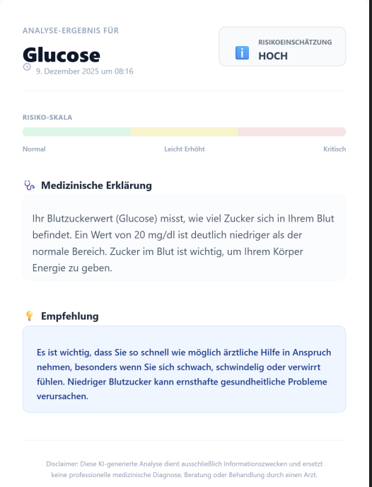

# Lab Result AI 

Eine **KI-gestützte Fullstack-Web-App**, die medizinische Laborwerte **verständlich für Laien erklärt**.

Der Fokus dieses Projekts liegt **nicht** darauf, KI als Buzzword zu verwenden,  
sondern sie **kontrolliert, nachvollziehbar und technisch sauber** in eine reale Anwendung zu integrieren.

**Grundidee:**

> Klare Daten → saubere API → kontrollierter KI-Output

---

## Screenshots

## Worum geht es?

Viele Menschen erhalten Laborbefunde, können diese jedoch **inhaltlich kaum einordnen**.  
Medizinische Fachbegriffe, Referenzbereiche und Risiken sind für Laien oft schwer verständlich.

Diese Anwendung nutzt KI gezielt, um:
- medizinische Fachbegriffe verständlich zu erklären
- Laborwerte risikobasiert einzuordnen (**ohne Diagnose**)
- strukturierte, gut lesbare Ergebnisse zu liefern

---

## Funktionsumfang

- 🧠 **KI-basierte Erklärung von Laborwerten**
- ⚠️ **Risikolevel mit Handlungsempfehlung** (keine medizinische Diagnose)
- 🧾 **Strukturierte Ergebnisdarstellung** in einer klaren Karten-UI
- 📊 **Verlauf & Trendanzeige** für wiederholte Messungen
- 📄 **PDF-Export** der Analyseergebnisse
- 🔐 **Datenschutzfreundliche Verarbeitung**
  - Keine dauerhafte Speicherung sensibler Daten
  - Verlauf lokal im Browser

---

## Technischer Fokus

Dieses Projekt legt besonderen Wert auf **saubere Software-Architektur**:

- Klar definierter **API-Vertrag** zwischen Frontend und Backend
- **Prompt Engineering** für strukturierte, vorhersagbare JSON-Antworten
- **Backend-Validierung & Parsing** der KI-Ausgaben
- Trennung von:
  - Fachlogik
  - KI-Logik
  - Präsentationsschicht
- **Frontend-ready API-Design** für einfache Erweiterbarkeit

---

## Tech Stack

### Backend
- Java  
- Spring Boot  
- REST API  
- OpenAI API  

### Frontend
- React  
- Vite  

### Infrastruktur
- Docker  
- Render (Backend Deployment)  
- Vercel (Frontend Deployment)  

### Tools
- Git  
- GitHub  
- Postman  

---

## Projektziel

Ziel dieses Projekts ist es zu zeigen, wie **KI sinnvoll, verantwortungsvoll und kontrolliert**
in eine reale Softwarelösung integriert werden kann —  
nicht als Selbstzweck, sondern als **unterstützendes Werkzeug innerhalb einer stabilen Architektur**.

---

## Hinweis (Disclaimer)

Diese Anwendung dient **ausschließlich Informationszwecken**.  
Sie ersetzt **keine ärztliche Diagnose, Beratung oder Behandlung**.  
Bei gesundheitlichen Fragen sollte immer medizinisches Fachpersonal konsultiert werden.

---

## Autor

Mahmoud Shaban  
GitHub: https://github.com/mahmoud-shaban-git
